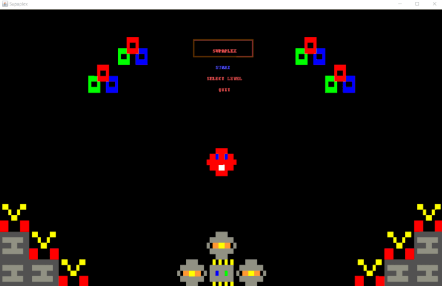

## LTDS_<T>08_<G>801 - <GameName> Supapl0x

The project is a clone of the 90's game Supaplex. We play as Murphy, a very brave and adventurous red ball on a mission to capture Infotrons. During his
quest he's faced with a series of challenges in the form of mazes which he must go through in order to find the Infotrons he needs. The mazes are dangerous
places, filled with scissors which can cut Murphy down, and rocks which can crush him. Murphy must use his environment wisely to beat his challenges and
reach the much desired EndBlock which takes him back home with his loot.
We choose to clone this classic game because 1) the graphical interface is suitable to implement in Lanterna; and 2) there are different blocks with
different behaviors - Murphy is player controlled, Scissors are NPCs with a crude form of AI, and Rocks are an environment block which can be moved. This
allows us to go through different implementation challenges and apply different Design Patterns, thus increasing the learning experience.

This project was developed by Fábio Sá (up202007658@edu.fe.up.pt), Pedro Barbeira (up201303693@edu.fe.up.pt) and José Diogo (202003529@edu.fe.up.pt) for LDTS 21/22.

### IMPLEMENTED FEATURES

- **Move** - Murphy will move according to the arrow key pressed by the user (up, down, left, right)
- **Eat** - The player can make Murphy eat an adjacent block without moving into it by pressing CTRL + ARROW
- **Unit Collision** - Murphy can't move against walls, Rocks and Scissors can only move if there's no block in front of them.
- **Menus** - Basic Layout for menus, including Main, select level and pause one.
- **States** - Structure for application flow.

### PLANNED FEATURES
- **Push** - Murphy can push Rocks which can move
- **Specific Behavior** - Rocks which can't be moved act as Walls and Scissors rotate when moving isn't possible.
- **Infotron Counter** - Murphy needs a certain number of Infotrons to beat each level
- **Explode** - Murphy explodes if he gets caught by a Scissor, and both Murphy and the Scissor explode when crushed by a Rock
- **Fall** - Rocks will fall if there's no supporting block underneath them
- **Restart** - Allows the user to restart the game at any given point.

### MAIN MENU AND SELECT LEVEL MENU DEMONSTRATION


------
### DESIGN

#### REPETITION OF OBJECTS

##### Problem in Context

Having multiple instances of certain objects could take up an unnecessary amount of memory while running. For example, the Sprites of each Model are presets,
and one instance of a Model (say, a Wall) will always have the same Sprite. Having to create a new Sprite every time we created a new Model object would not
only overload the memory with repeated objects but also require memory access through file reading, which would affect the system's performance.

##### The Pattern

To solve this, we applied the Singleton Pattern. By making each Sprite a Singleton we ensured that the file would only be read upon initialization, and each
object could get its corresponding Sprite through the getInstance() method. In fact, we implemented the Singleton Pattern in many more objects throughout
our game (some of which gave rise to other problems which will be discussed further down).

##### Implementation

Singletons were implemented using the standard Singleton template (although some had to be slightly modified, as we'll soon expose). Each object has a private
field of its own type, and a private constructor which initializes it. Instances of the object can be retrieved through the getInstance() method, which calls the private constructor if the field hasn't been initialized yet.

```java
class InfotronSprite extends Sprite {

    private static InfotronSprite sprite;

    private InfotronSprite(){
        Reader.fillSprite("Infotron", this);
    }

    public static InfotronSprite getInstance(){
        if (sprite == null)
            sprite = new InfotronSprite();
        return sprite;
    }
}
```

**Consequences**

The use of the Singleton Pattern provided the following benefits:
- There's only one possible instance of objects which are singular in the system (Sprites, Murphy, GameScreen, Display)
- Since the getInstance() method is a public static we can easily access the instance in any layer of the system without having to pass it as a parameter
- Changes in a Singleton ripple throughout the whole system, therefore a change made at the Model Level will also be accessible at the View Level, and so
  on and so forth

However, there were certain drawbacks:
- Constructors where private, therefore couldn't receive parameter arguments
- Certain objects (Murphy, GameScreen, Display) have to be reset after each level
-------
####CREATING SEVERAL INHERITED OBJECTS

**Problem in Context**

Our system is reading the Sprite information from a text document which contains a text image drawn with characters, each of which represent a color, as
in a bitmap. The Map information was stored in the same way, but instead of a color each character represented a type of Model. We had to find a way to
quickly translate the characters into color codes, in the first case, or into Models, in the second case. The same problem showed up in the Controller
layer, when parsing the user input to figure out which Action would Murphy do.

**The Pattern**

This is almost a textbook application of the Factory pattern. We applied different factories, which would either return the proper Strings (color), the
proper Bitmap for the Models (SpriteFactory) or the proper actions (actionFactory).

**Implementation**

Again, we followed the standard Factory template. Here are the snippets:

```java
public class SpriteFactory {

    public static Sprite factoryMethod(char c) {
        return switch (c) {
            case 'W' -> WallSprite.getInstance();
            case 'B' -> BaseSprite.getInstance();
            case 'C' -> ChipSprite.getInstance();
            case 'E' -> EndSprite.getInstance();
            case 'M' -> MurphySprite.getInstance();
            case 'I' -> InfotronSprite.getInstance();
            case 'X' -> ScissorsSprite.getInstance();
            case 'O' -> RockSprite.getInstance();
            default  ->  null;
        };
    }
}
```

**Consequences**

- Adding a new color, a new Model or a new Action to our system would require minimal effort, since the factory would handle the creation
- We could freely use inheritance without having to instantiate new objects "by hand" each time we had to
- We kept the code readable and free from long conditional chains
------
### KNOWN CODE SMELLS AND REFACTORING SUGGESTIONS
> This section should describe 3 to 5 different code smells that you have identified in your current implementation, and suggest ways in which the code could be refactored to eliminate them. Each smell and refactoring suggestions should be described in its own subsection.

#### USING PRIMITIVES INSTEAD OF OBJECTS

##### Example of such a subsection:


#### USING A DATA CLASS (Class that only exists to store variables)

We are aware that we currently have this smell in our code, but we are still discussing 
the best way to contour this problem.
```java
class ScreenSettings {
    
public static final Integer x = 5;   //How many blocks to the side of murphy
public static final Integer y = 3;
public Integer yMin;
public Integer yMax;
public Integer xMin;
public Integer xMax;

}

```

------

### TESTING

- Screenshot of coverage report.
- Link to mutation testing report.

### SELF-EVALUATION

#### Example:

- Fábio Sá: %
- Pedro Barbeira: %
- José Diogo: %